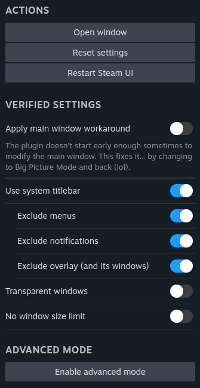

# Change Window Parameters

Modify how Steam displays windows.

## Settings

After changing settings, you must click the "Restart Steam UI" button if you want the changes to apply immediately.

Verified settings are not compatible with advanced mode, so you will have to perform the aforementioned (verified settings take priority) and use advanced mode only.

## Themes

The plugin adds each parameter _in its options_ as an attribute to the `<html>` element, i.e. the "Transparent windows" option adds the `createflags="Resizable Composited TransparentParentWindow"` attribute.

## Advanced mode

Anything not in verified settings may have **unintended side effects** if you don't know what you're doing! If anything bad happens, you can always execute the `steam://millennium/settings/plugins/disable/steam-change-window-params` URL to disable the plugin. Do NOT open issues about anything in advanced mode.

Params' behavior without a description is unknown. Feel free to document (and show it in the PR) its behavior [here](https://github.com/ricewind012/steam-change-window-params/blob/master/locales/english.json).
